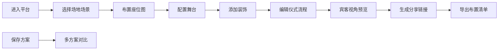

## 1. 产品概述

元宇宙虚拟婚礼策划平台是一款面向虚拟婚礼策划师的纯前端网页工具，帮助策划师在沉浸式3D场景中设计和布置线上婚礼仪式空间。

- **核心价值**：将传统婚礼策划数字化，通过直观的拖拽式操作和实时预览，大幅提升策划效率和客户沟通效果
- **目标用户**：专业婚礼策划师、婚庆公司设计人员、新人自主策划者
- **市场定位**：国内首款专注于元宇宙婚礼空间设计的专业级SaaS工具

## 2. 核心功能

### 2.1 用户角色

| 角色 | 注册方式 | 核心权限 |
|------|----------|----------|
| 婚礼策划师 | 无需注册 | 完整使用所有设计功能，保存方案，导出清单 |

### 2.2 功能模块

1. **场地选择页**：海岛/花园场景切换，昼夜氛围预览
2. **座位图页**：拖拽桌椅，设置宾客席位，安排入场路线
3. **舞台页**：舞台配置，司仪台设置，新人形象上传
4. **装饰页**：花艺布置，灯光设计，背景音乐配置
5. **流程页**：仪式流程编辑，时间轴管理
6. **宾客预览页**：宾客视角预览，场景漫游
7. **分享页**：邀请链接生成，布置清单导出，多方案管理，预算对比

### 2.3 页面详情

| 页面名称 | 模块名称 | 功能描述 |
|----------|----------|----------|
| 场地选择 | 场景选择 | 海岛/花园两种场景切换，场景缩略图预览 |
| 场地选择 | 氛围切换 | 昼夜模式切换，实时光照效果预览 |
| 场地选择 | 方案管理 | 保存多个方案，切换/删除方案，一键恢复默认布局 |
| 座位图 | 家具库 | 多种桌椅款式选择，分类展示（圆桌/长桌/椅子） |
| 座位图 | 拖拽布置 | 拖拽家具到场景，旋转/缩放/删除操作 |
| 座位图 | 宾客管理 | 为座位分配宾客，标注VIP席位，显示座位状态 |
| 座位图 | 路线规划 | 绘制入场路线，显示行进方向 |
| 座位图 | 未完成标记 | 标记待办事项，进度追踪 |
| 舞台 | 舞台配置 | 舞台大小/位置调整，T台设置 |
| 舞台 | 司仪台 | 司仪台位置/样式配置 |
| 舞台 | 新人形象 | 上传新人头像/全身照，放置在舞台上 |
| 装饰 | 花艺布置 | 多种花艺组件选择，拖拽放置 |
| 装饰 | 灯光设计 | 灯光类型/颜色/位置设置，氛围灯效预览 |
| 装饰 | 背景音乐 | 上传/选择背景音乐，音量控制 |
| 流程 | 流程编辑 | 添加/删除/排序仪式环节，设置每个环节时长 |
| 流程 | 时间轴 | 可视化时间轴展示，环节拖拽排序 |
| 宾客预览 | 视角切换 | 宾客座位视角切换，第一人称漫游 |
| 宾客预览 | 场景漫游 | 缩放/平移/旋转查看整个场景 |
| 分享 | 邀请链接 | 生成可分享的预览链接 |
| 分享 | 布置清单 | 导出布置清单（Excel/CSV/PDF） |
| 分享 | 预算对比 | 不同方案预算对比，成本分析 |
| 分享 | 未完成事项 | 待办事项列表，完成状态标记 |

## 3. 核心流程

用户从场地选择开始，依次完成座位布置、舞台配置、装饰设计、流程编排后，通过宾客视角预览整体效果，最后生成分享链接和导出布置清单。支持随时保存多个方案进行对比。

## 4. 用户界面设计

### 4.1 设计风格

- **主色调**：浪漫玫瑰金 `#E8C4A0`、纯净象牙白 `#FFFAF5`、深邃香槟金 `#C9A961`
- **辅助色**：柔雾粉 `#F5E6E0`、薄荷绿 `#D4E4DB`、星空蓝 `#1A2A4A`（夜间模式）
- **字体**：标题使用 Cinzel（优雅衬线），正文使用 Noto Sans SC（易读无衬线）
- **按钮风格**：圆角8px，轻微浮雕效果，悬停时上浮2px配柔和阴影
- **布局风格**：左侧工具栏 + 中央画布 + 右侧属性面板的三栏式专业设计器布局
- **图标风格**：线性细边图标，统一2px描边，圆角末端

### 4.2 页面设计概述

| 页面名称 | 模块名称 | UI元素 |
|----------|----------|----------|
| 场地选择 | 场景卡片 | 3D场景缩略图、hover光效、选中状态边框、渐变叠加 |
| 场地选择 | 昼夜切换 | 双态滑动开关，太阳/月亮图标切换动画 |
| 座位图 | 家具库 | 分类标签页、卡片式家具列表、拖拽时半透明预览 |
| 座位图 | 画布区域 | 网格背景、家具选中高亮、拖拽辅助线、吸附对齐 |
| 座位图 | 属性面板 | 宾客姓名输入、VIP标记、座位号、删除按钮 |
| 舞台 | 预览区域 | 3D透视舞台、新人占位符、可调节控制点 |
| 装饰 | 元素面板 | 分类折叠面板、颜色选择器、滑块控件 |
| 流程 | 时间轴 | 可拖拽卡片、时间刻度、进度条、播放动画 |
| 宾客预览 | 漫游视图 | 第一人称视角、移动控制按钮、视角切换器 |
| 分享 | 方案列表 | 方案卡片、缩略图、预算标签、对比复选框 |

### 4.3 响应式

- **设计原则**：桌面优先设计，1440px为基准，向下兼容到1024px
- **平板适配**：右侧面板改为底部抽屉，工具栏改为图标化折叠
- **触控优化**：拖拽区域扩大到48x48px，按钮最小尺寸44x44px
- **画布响应式**：使用CSS contain和ResizeObserver保证渲染性能

### 4.4 3D场景指引

- **环境氛围**：
  - 白天：HDRI使用晴朗天空，暖色调阳光，柔和阴影
  - 夜间：星空背景，暖光点光源，萤火虫粒子效果
  - 海岛场景：碧海蓝天，白沙滩，椰林背景
  - 花园场景：繁花似锦，绿草地，欧式喷泉
- **光照设置**：
  - 主光：DirectionalLight模拟阳光/月光
  - 环境光：AmbientLight提供基础照明
  - 补光：PointLight装饰灯/路灯效果
- **相机设置**：
  - 设计模式：OrbitControls，45度俯视角
  - 预览模式：第一人称，高度1.6m模拟真实视角
- **交互动画**：
  - 家具放置：scale弹性动画
  - 昼夜切换：颜色平滑过渡3s
  - 选中物体：呼吸发光效果
- **后处理**：
  - Bloom效果增强灯光氛围
  - 轻微Vignette增加沉浸感
  - FXAA抗锯齿
- **性能优化**：
  - 实例化渲染重复物体
  - LOD分级显示
  - 阴影贴图限制在1024x1024
