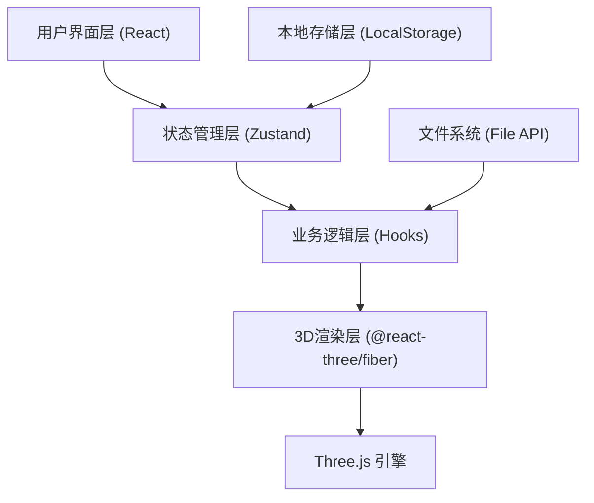
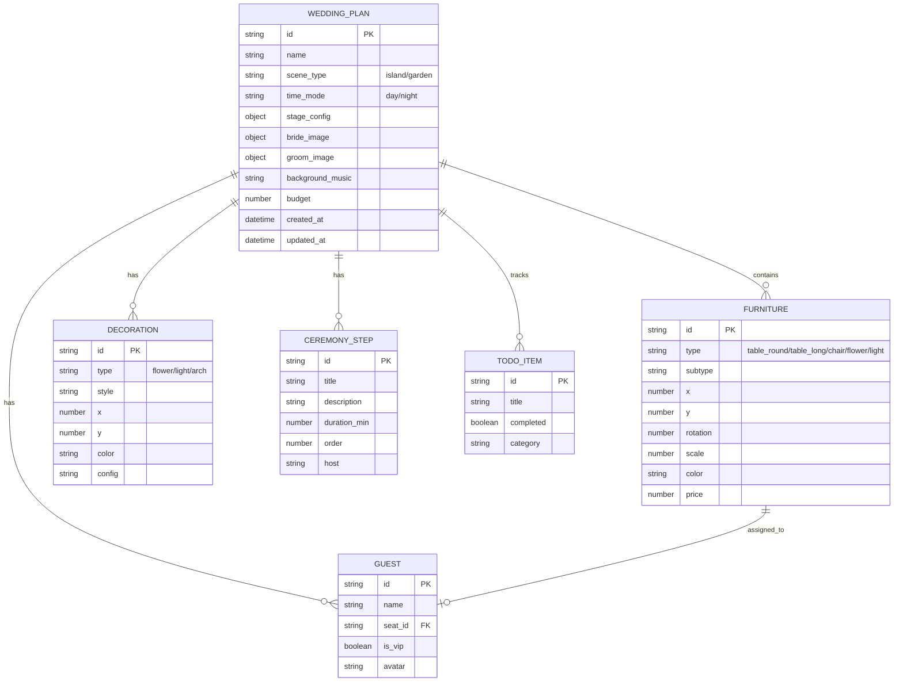

## 1. 架构设计



### 架构说明
- **纯前端架构**：无后端服务，所有数据存储在浏览器LocalStorage
- **分层设计**：UI层、状态层、业务逻辑层、渲染层分离
- **3D渲染**：使用@react-three/fiber封装Three.js实现场景渲染
- **数据持久化**：Zustand + LocalStorage实现方案自动保存

## 2. 技术描述

- **前端框架**：React@18 + TypeScript@5 + Vite@5
- **状态管理**：zustand@4
- **路由管理**：react-router-dom@6
- **样式方案**：tailwindcss@3 + postcss@8
- **3D渲染**：three@0.160 + @react-three/fiber@8 + @react-three/drei@9 + @react-three/postprocessing@2
- **拖拽交互**：@dnd-kit/core + @dnd-kit/sortable
- **图标库**：lucide-react
- **导出功能**：xlsx (Excel导出) + jspdf (PDF导出)
- **时间处理**：dayjs
- **初始化工具**：vite-init
- **包管理器**：npm

## 3. 路由定义

| 路由 | 页面 | 说明 |
|------|------|------|
| /venue | 场地选择页 | 场景选择、昼夜切换、方案管理 |
| /seating | 座位图页 | 家具拖拽、宾客分配、路线规划 |
| /stage | 舞台页 | 舞台配置、司仪台、新人形象上传 |
| /decoration | 装饰页 | 花艺、灯光、背景音乐 |
| /ceremony | 流程页 | 仪式流程编辑、时间轴 |
| /preview | 宾客预览页 | 第一人称视角预览、场景漫游 |
| /share | 分享页 | 邀请链接、导出清单、预算对比 |

## 4. 数据模型

### 4.1 数据模型定义



### 4.2 类型定义

```typescript
// src/store/types.ts

export type SceneType = 'island' | 'garden';
export type TimeMode = 'day' | 'night';
export type FurnitureType = 'table_round' | 'table_long' | 'chair' | 'podium' | 'flower' | 'light';
export type DecorationType = 'flower_arrangement' | 'lantern' | 'arch' | 'candle';

export interface Position {
  x: number;
  y: number;
}

export interface Furniture {
  id: string;
  type: FurnitureType;
  subtype: string;
  x: number;
  y: number;
  rotation: number;
  scale: number;
  color: string;
  price: number;
  guestId?: string;
}

export interface Guest {
  id: string;
  name: string;
  isVip: boolean;
  avatar?: string;
  seatId?: string;
}

export interface StageConfig {
  x: number;
  y: number;
  width: number;
  height: number;
  hasTStage: boolean;
  tStageLength: number;
  podiumX: number;
  podiumY: number;
}

export interface Decoration {
  id: string;
  type: DecorationType;
  style: string;
  x: number;
  y: number;
  color: string;
  config: Record<string, any>;
}

export interface CeremonyStep {
  id: string;
  title: string;
  description: string;
  durationMin: number;
  order: number;
  host: string;
}

export interface TodoItem {
  id: string;
  title: string;
  completed: boolean;
  category: string;
}

export interface WeddingPlan {
  id: string;
  name: string;
  sceneType: SceneType;
  timeMode: TimeMode;
  stageConfig: StageConfig;
  furniture: Furniture[];
  guests: Guest[];
  decorations: Decoration[];
  ceremonySteps: CeremonyStep[];
  todos: TodoItem[];
  brideImage?: string;
  groomImage?: string;
  backgroundMusic?: string;
  budget: number;
  entrancePath: Position[];
  createdAt: string;
  updatedAt: string;
}

export interface AppState {
  currentPlanId: string;
  plans: Record<string, WeddingPlan>;
  selectedFurnitureId: string | null;
  comparePlanIds: string[];
}
```

### 4.3 本地存储键名

- `wedding_plans`: 存储所有方案数据
- `wedding_current_plan_id`: 当前编辑的方案ID
- `wedding_settings`: 用户偏好设置
